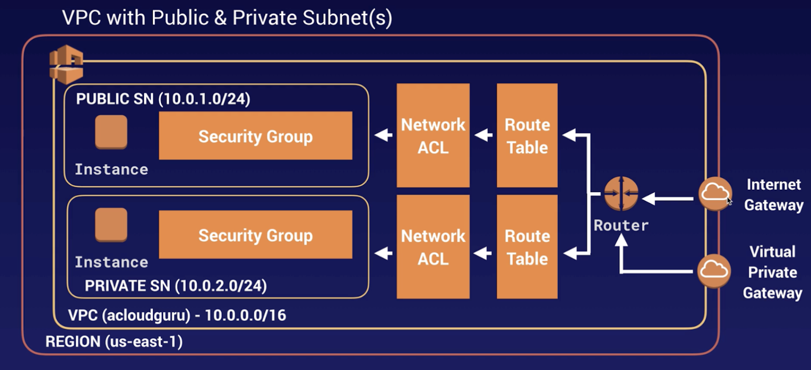

VPC

## Virtual Private Cloud

Virtual data centre in the cloud, that lets you provision a logically isolated section of AWS. 

#### VPC gives you complete control the following:
    - Virtual networking environment
    - Selection over your own IP range
    - Creation of Subnets
    - Configuration of route tables
    - Configuration of network gateways

#### Key points to remember
- 1x Subnet = 1x Availability Zone
- 1x Subnet cannot be stretched across AZs, but you can have multiple subnets in a single AZ.
- Security groups are stateful
- Network Access Control Lists are stateless. Stateless means you can add deny rules as well as allow. With stateless, when you open a port on outbound, you have to open it on inbound also

#### Use case 

You can create a public-facing subnet for your webservers, that has access to the internet. You could place your backend systems such as databases or app servers in a private facing subnet with no internet access. You could leverage multiple layers of security including, security groups, network access control lists(NACLs) to help access ECS2 instances in each subnet.
Additionally, you can create a VPN connection between your corporate datacentre and your VPC and leverage the AWS cloud as an extension of your corporate datacentre.

#### CIDR or Classless Inter-Domain Routing

A notation for describing blocks of IP addresses, and is used heavily in various networking configurations. IP addresses contain 4 octets, each consisting of 8 bits giving values between 0 and 255. The decimal value that comes after the slash is the number of bits consisting of routing prefix. This, in turn, can be translated into a netmask, and also designates how many available addresses are in the block.
10.0.0.0/16 most commonly used for corporate networks
/28 the smallest subnet you’re allowed to have in an AWS VPC

#### Default vs Custom VPC on AWS

Default
User-friendly, immediately deploy instances
All subnets have a route out to the internet
Each EC2 instance has both a public and private IP address
If you delete a default VPC you can now recover it

#### VPC Peering

Allows you to connect one VPC to another via a direct network route using private IP addresses.

- Instances behave as if they were on the same private network.
- You can peer VPC with other AWS accounts.
- You can peer across regions.
- Peering is in a star configuration, i.e. one central VPC peers with 4 others. No transitive peering. This mean you can peer through one, to another, you have to set up peering between B and C(see diagram below)

#### NAT instances and NAT gateways

Allow private instances in private subnets to download things like MySQL and other software available on the internet.

TL;DR 
Nat Gateways are highly available and 9 times out of 10 this is what you want. Unlike Nat instances which are outdated and on their way out.

##### NAT Instances 
Not really used anymore - but could come up in the exam. They’re not scalable like Nat gateway is.
- When creating, you must Disable source/destination check on the instance
- Must be in a public subnet.
- Here must be a route out of the private subnet to the NAT instance in order for this to work.
- The amount of traffic it can support depends on the instance size. 
- If there is a bottleneck, increase the instance size
- You can create HA using ASGs, multiple subnets in different AZs and script auto failover.
- Always behind a security group

##### Nat Gateways
- Redundant inside the AZ, they’re not a single ec2 instance.
- Scales automatically.
- No need to patch.
- Not associated with security groups.
- Automatically assigned a public IP address.
- Remember to update your Route tables(allow access to the internet).
- No need to disable source/destination checks
- To create an AZ independent architecture, create a NAT gateway in each AZ zone, then you should look to configure your routing to ensure that resources use the NAT gateway in the same AZ.

##### Access Control Lists(ACL)

Your VPC automatically comes with a default network ACL, and by default, it allows all outbound and inbound traffic. You can create custom network ACLs. By default, each custom network ACL denies all inbound and outbound traffic until you add rules.

Each subnet in your VPC MUST be associated with a network ACL. If you don’t explicitly associate a subnet with a network ACL, the subnet is automatically associated with the default ACL.

- Block IP addresses with ACLs, not Security Groups
- You can associate an ACL with multiple subnets, however, a subnet can be associated with only one network ACL at a time. When you associate a network ACL with a subnet, the previous association in removed.
- ACLs contain a numbered list of rules evaluated in order starting with the lowest numbered rule.
- Separate inbound and outbound rules.
- Each rule can either allow or deny traffic.
- Stateless, unlike security groups.

##### VPC Flow Logs

Capture info about the IP traffic going to and from network interfaces in your VPC.
Basically, a way to store the network traffic going on in your VPC.

- Flow log data is stored using CloudWatch logs.
- After you have created a flow log, you can view and retrieve its data in CloudWatch.
Logs can also be stored in S3. You can have logs between peered VPCs, but only if they are in the same account.
- You cant change the IAM role for a flow log once created.
- Not all IP traffic is monitored, such as reserved IP address, windows license activation, aws DNS server traffic, instance metadata

Flow logs can be created at three levels:
- VPC
- Subnet
- Network interface

##### NAT vs Bastions

A NAT gateway or instance is used to provide internet traffic to EC2 instances in private subnets, whereas Bastions are used to securely administer EC2 instances(using SSH or RDP)
You cannot use a NAT gateway as a Bastion host.

##### Bastion hosts

Special purpose computer on the network, designed and configured to withstand attacks. It is hardened due to its location in a network, for example, it could be in a public subnet.

A Bastion allows instances within private subnets, to be SSHd or RDPd into.

##### Direct Connect

A cloud service solution, easy to establish a dedicated network connection from your premises to AWS. You can establish private connectivity between AWS and your datacentre, office, etc which in many cases can reduce your network costs, increase bandwidth throughput, and provide a more consistent network experience over Internet-based connections.

Useful for high throughput workloads.

If you need a stable and reliable secure connection
Example, VPN connection drops out because of high throughput, direct connect could help here

##### Global Accelerator

A service to create accelerators to improve availability and performance of your applications for local and global users.
Global Accelerator direct traffic to optimal endpoints over the AWS global network. This improves the availability and performance of your internet applications that are used by a global audience.

By default, Global Accelerator provides you with two static IP addresses that you associate with your accelerator. Alternatively, you can bring your own.

When you create an Accelerator, it will assign you a default DNS name, something like asdfghj12345.awsglobalaccelerator.com - that point to the static IP address you were assigned.

Depending on the use case, you can use your accelerators IP address or DNS name to route traffic to your accelerator, or set up DNS records to route traffic using your own custom domain name.

Network zones - these are similar to AZs. They’re an isolated unit with ita own set of physical infrastructure.

Listener - process inbound connection from clients to the Global Accelerator, based on the port and protocol you configure. Supports both TCP and UDP.
Each listener has one or more endpoint groups associated with it, and traffic is forwarded to endpoints on one of the groups.

Endpoint groups - associated with a specific AWS region. Endpoint groups include one or more endpoints in the Region. You can increase/decrease the percentage of traffic that would be otherwise directed to an endpoint group by adjusting a setting called traffic dial. The dial can be used for testing, blue/green etc.

Endpoint - Can be NLB, ALB EC2s, or Elastic IP address.
An ALB endpoint can be an internet-facing or internal. Traffic is routed to endpoints based on configuration options that you choose, such as endpoint weights.
Weights are the proportion of traffic to route to each endpoint. Perhaps to do testing.

Exam tips for Global Accelerator:
- Improve availability and performance on applications for local and global uses
2 static IPs, or bring your own
- Control traffic using traffic dials
- Traffic weighting can be done on individual endpoints

##### VPC Endpoints

Privately connect your VPC to supported AWS services, powered by PrivateLink, without requiring an internet gateway, NAT device, VPN or direct connect.

Endpoints are virtual devices, they are horizontally scaled, redundant, and highly available VPC components that allow communication between instances in your VP and services without imposing availability risks or bandwidth constraints on your network.

Two types of endpoints:

Interface
- No need to traverse the internet. 
- Example, send data outside the VPC network to S3, from a private instance.

Gateway
- Supports S3
- DynamoDB

TIPS: 

- When provisioning a load balancer you need at least 2 public subnets.

- Attaching an IGW to a VPC allows instances with public IPs to access the internet,
while NAT(s) Gateway allows instances with no public IPs to access the internet.
